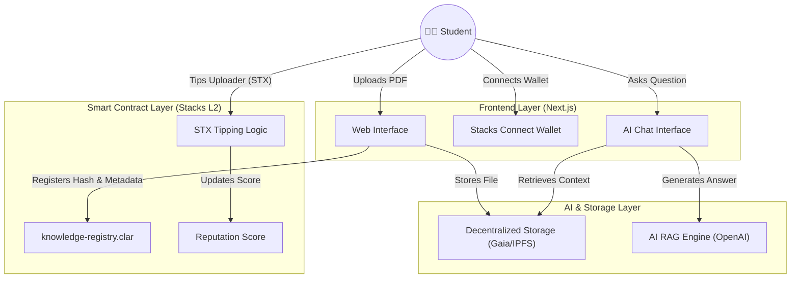

# StackKnowledge 🎓


**StackKnowledge** is a decentralized "Share-to-Earn" educational platform built on the **Stacks Blockchain**. It incentivizes students to share high-quality academic resources (past questions, handouts) and features an **AI-powered Study Buddy** that provides answers *strictly* based on the uploaded materials.

> **Why Stacks?** We use Stacks to anchor intellectual property and reputation on Bitcoin. Every upload is registered on-chain, and tips are settled in STX (Bitcoin L2).

---

## 🏗️ Architecture

### System Overview
The platform connects a modern Web2 interface with Web3 incentives and AI logic.



---

## 🚀 Key Features

### 1. 📚 Share-to-Earn (S2E)
-   **Upload Resources:** Students upload handouts and past exams.
-   **On-Chain Registry:** Resource metadata (Title, Hash, Uploader) is stored permanently in the `knowledge-registry` smart contract.
-   **Earn STX:** Other students can **tip STX** to the uploader if the material helped them study.

### 2. 🤖 Context-Aware AI Tutor
-   **Strict RAG (Retrieval-Augmented Generation):** The AI answers questions *only* using the context from the specific handout you are viewing.
-   **No Hallucinations:** Prevents the AI from making up facts; it must cite the document.

### 3. 🏆 On-Chain Reputation
-   **Verified Contributions:** Your contribution history is public and verifiable on the Stacks blockchain.
-   **Top Contributors:** The contract tracks tip volume and reputation scores.

### 4. 🌓 Dark Mode & Modern UI
-   **Theme Support:** Full light and dark mode support using `next-themes`.
-   **Micro-animations:** Smooth transitions and interactions powered by `framer-motion`.
-   **Responsive Design:** Fully mobile-responsive layout with a custom mobile navigation menu.
-   **Modern Components:** Standardized UI library using Tailwind CSS and Lucide icons.
-   **Refined UX:** Premium leaderboard, interactive analytics, and polished resource detail pages.

### 5. 🛠️ Robust Infrastructure
-   **Strict Type Safety:** Comprehensive TypeScript interfaces for Resources, Users, and Leaders.
-   **Optimized Performance:** Efficient data fetching with `useCallback` and async effects.
-   **Developer Experience:** Extensive JSDoc documentation and standardized component variants.

---

## 🛠️ Technology Stack

| Component | Tech | Description |
| :--- | :--- | :--- |
| **Blockchain** | **Stacks (Clarinet)** | Smart contracts for registry and tipping via `knowledge-registry.clar`. |
| **Frontend** | **Next.js 15 (App Router)** | React framework with Server Components and dynamic routing. |
| **Animation** | **Framer Motion** | High-performance production-ready animations. |
| **Theming** | **Next Themes** | Efficient dark mode management with system preference detection. |
| **Styling** | **Tailwind CSS** | Modern utility-first styling with Class-based theme switching. |
| **Icons** | **Lucide React** | Clean and consistent SVG icon set. |
| **Integration** | **Stacks.js** | Wallet connection (`@stacks/connect`) and transaction handling. |
| **Language** | **TypeScript** | Type-safe development for both frontend and testing. |

## 📖 Documentation

Detailed project documentation is available in the [docs/](./docs) directory:
- [Architecture](./docs/ARCHITECTURE.md) - Deep dive into system design.
- [Feature Roadmap](./docs/FEATURE_ROADMAP.md) - Planned and completed features.
- [Quick Start](./docs/QUICK_START.md) - Extended setup guide.
- [Contributing](./docs/CONTRIBUTING.md) - Guidelines for developers.

---

## 📁 Project Structure

The project is organized into a monorepo for better separation of concerns:

-   **`frontend/`**: The Next.js web application.
    -   `app/`: App router pages and layouts.
    -   `components/`: Reusable UI components.
    -   `hooks/`: Custom React hooks.
    -   `lib/`: Utilities, constants, and analytics.
-   **`backend/`**: Stacks smart contracts and blockchain logic.
    -   `contracts/`: Clarity smart contracts.
    -   `tests/`: Smart contract unit tests.
    -   `Clarinet.toml`: Clarinet configuration.
-   **`docs/`**: Project documentation and architecture details.

---

## ⚡ Getting Started

### Prerequisites
-   Node.js 18+
-   [Clarinet](https://github.com/hirosystems/clarinet) (for smart contracts)
-   Stacks Wallet (Leather or Xverse)

### Installation

1.  **Clone the repo:**
    ```bash
    git clone https://github.com/Yilkash/stack-knowledge.git
    cd stack-knowledge
    ```

2.  **Install All Dependencies:**
    ```bash
    npm install
    # This installs dependencies for the frontend workspace
    ```

3.  **Run Development Server:**
    ```bash
    npm run dev
    ```
    Open [http://localhost:3000](http://localhost:3000) in your browser.

4.  **Run Smart Contract Tests:**
    ```bash
    npm run test:backend
    # Or manually: cd backend && clarinet test
    ```

---

## 📜 Smart Contract Interface

The `knowledge-registry` contract exposes the following functions:

-   `(register-resource (name (string-utf8 100)) ...)`: Registers a new file.
-   `(tip-resource (resource-id uint) (amount uint))`: Sends STX to the resource owner.
-   `(get-resource (resource-id uint))`: Fetches metadata.
-   `(get-user-reputation (user principal))`: Returns total reputation.

---

## 🤝 Contributing

Contributions are welcome! Please fork the repository and submit a Pull Request.

1.  Fork the Project
2.  Create your Feature Branch (`git checkout -b feature/AmazingFeature`)
3.  Commit your Changes (`git commit -m 'feat: Add some AmazingFeature'`)
4.  Push to the Branch (`git push origin feature/AmazingFeature`)
5.  Open a Pull Request

---

*Verified on Stacks Testnet* 🟣